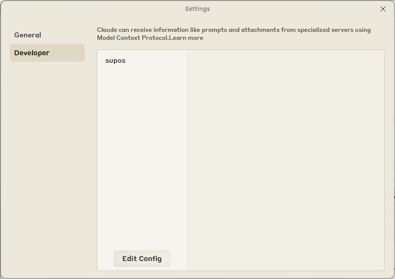

[English][readme-en-link] | **简体中文**

# supOS MCP Server

本MCP服务器是基于 [Model Context Protocol (MCP)](https://modelcontextprotocol.io/introduction) 协议提供的 `typescript-sdk` 进行开发，可以让任何支持MCP协议的客户端使用它。 

它提供了一系列supOS的open-api，例如：查询topic树结构，topic详情等。

<a href="https://glama.ai/mcp/servers/7ayh12mg77">
   
 </a>

## 支持的API

### Tools
1. `get-model-topic-tree`
   - 查询topic 树结构菜单数据
   - 输入:
     - `key` (string): Fuzzy search keyword for child nodes
     - `showRec` (boolean): Number of records to display
     - `type` (string): Search type: 1--Text search, 2--Tag search
   - 返回: topic 树结构菜单数据

2. `get-model-topic-detail`
   - 获取某个topic详情
   - 输入:
     - `topic` (string): The topic path corresponding to the model
   - 返回: 某个topic详情
3. `get-topic-realtime-data`
   - 获取某个topic的实时数据
   - 输入:
     - `topic` (string): The topic path corresponding to the model
   - 返回: 某个topic实时数据
4. `get-all-topic-realtime-data`
   - 获取所有topic的实时数据并分析
   - 返回: 所有topic实时数据
5. `get-topic-history-data-by-graphql`
   - 从graphql获取特定主题的历史数据
   - 输入:
     - `topic` (string): The topic path corresponding to the model
     - `limit` (number): Limit number of records
     - `startTime` (string): Start time in ISO 8601 format, e.g., 2025-04-13T00:00:00Z. If not specified, defaults to one week before the current time
     - `endTime`: End time in ISO 8601 format, e.g., 2025-04-20T23:59:59Z. If not specified, defaults to the current time
   - 返回：指定主题的历史数据

***接下来跟随文档一起使用吧***

## 开始使用

### 系统要求
- Node.js

### 安装客户端
目前支持MCP协议的客户端已有很多，比如桌面端应用 `Claude for Desktop`，或者IDE的一些插件等（`VSCode` 的 `Cline` 插件），想了解已支持的客户端可访问 [Model Context Protocol Client](https://modelcontextprotocol.io/clients)。

这里以 `Claude for Desktop` 为例。
- 下载 [Claude for Desktop](https://claude.ai/download)。
- 为 `Claude for Desktop` 配置所需的MCP 服务器。

- - 在文本编辑器中打开您的 `Claude for Desktop` 配置：`~/Library/Application Support/Claude/claude_desktop_config.json`。
- - 也可以通过 `File -> Setting -> Developer` 点击 `Edit Config` 找到该配置文件位置：



- - 打开配置文件后，添加以下内容到 `claude_desktop_config.json`中，并重启应用:  
*注意：每次修改该配置文件后都需要重启应用才会生效。*

    ```json
    {
      "mcpServers": {
        "supos": {
          "command": "npx",
          "args": [
            "-y",
            "mcp-server-supos"
          ],
          "env": {
            "SUPOS_API_KEY": "<API_KEY>",
            "SUPOS_API_URL": "<API_URL>",
            "SUPOS_MQTT_URL": "<MQTT_URL>"
          }
        }
      }
    }
    ```
- - 其中 `API_URL` 是可访问的[supOS社区版](https://supos-demo.supos.app/)地址。`API_KEY` 可通过登录社区版后，进入 `DataModeling -> 查看某个具体的topic详情 -> Data Operation -> Fetch`，找到对应的ApiKey复制即可，`MQTT_URL`可通过访问 `UNS -> MqttBroker -> Listeners` 查看可订阅的地址。

**注意：以上配置MCP服务器是借助 `npx` 拉取 `mcp-server-supos` npm包并在本地运行的方式给客户端提供服务。但 `npx` 在 `Windows` 系统下读取环境变量 `env` 配置时可能会出错，因此可以采用下面方式解决：**

### 本地运行服务
以下两种方式选择一种即可：

- 本地安装 `mcp-server-supos`，并通过node运行

1. Install
```bash
npm install mcp-server-supos -g
```

2. 找到安装的包路径，例如： `"C://Users//<USER_NAME>//AppData//Roaming//npm//node_modules//mcp-server-supos//dist//index.js"`

3. 修改 `claude_desktop_config.json` 的配置，并重启应用
```json
{
  "mcpServers": {
    "supos": {
      "command": "node",
      "args": [
        "C://Users//<USER_NAME>//AppData//Roaming//npm//node_modules//mcp-server-supos//dist//index.js"
      ],
      "env": {
        "SUPOS_API_KEY": "<API_KEY>",
        "SUPOS_API_URL": "<API_URL>",
        "SUPOS_MQTT_URL": "<MQTT_URL>"
      }
    }
  }
}
```

- 下载本仓库源码本地编译执行

1. 复制仓库:
```bash
git clone https://github.com/FREEZONEX/mcp-server-supos.git
```
2. 安装依赖
```bash
npm ci
```
3. 编译
```bash
npm run build
```
4. 修改 `claude_desktop_config.json` 的配置，并重启应用
```json
{
  "mcpServers": {
    "supos": {
      "command": "node",
      "args": [
        "<本地项目地址>//dist//index.js"
      ],
      "env": {
        "SUPOS_API_KEY": "<API_KEY>",
        "SUPOS_API_URL": "<API_URL>",
        "SUPOS_MQTT_URL": "<MQTT_URL>"
      }
    }
  }
}
```

### 结语
以上就是使用该服务的全部教程，配置成功后可在以下面板中看到对应的服务和工具等：


### 最后的最后
[supOS社区版](https://supos-demo.supos.app/) 已集成 `CopilotKit` 作者开源的 [open-mcp-client](https://github.com/CopilotKit/open-mcp-client)，并内置了 `mcp-server-supos` 服务，且支持ts版本的 `agent`，源码可访问 [supOS-CE-McpClient](https://github.com/FREEZONEX/supOS-CE-McpClient)。

## 许可证

本项目采用 Apache License 2.0 许可证 - 查看 [LICENSE](./LICENSE) 文件了解详情。

<!-- Links -->

[readme-en-link]: ./README.md