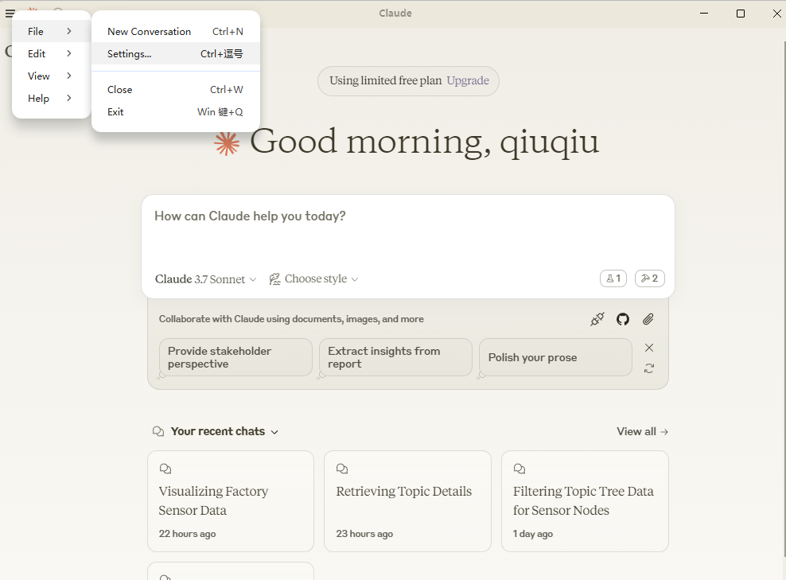
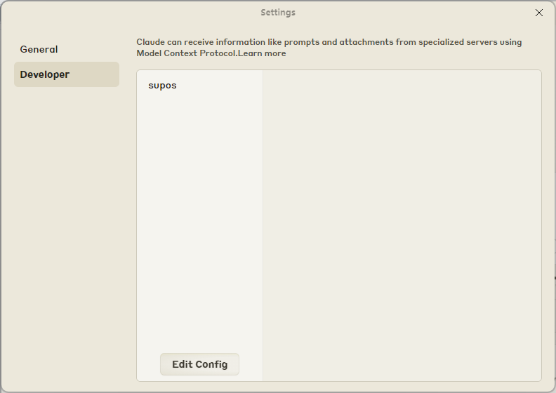
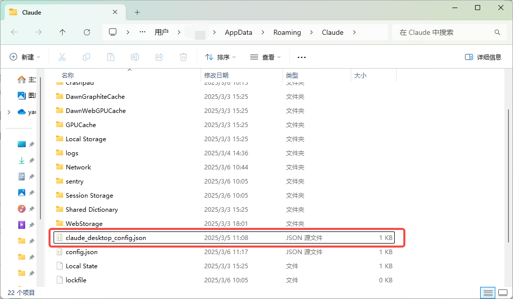
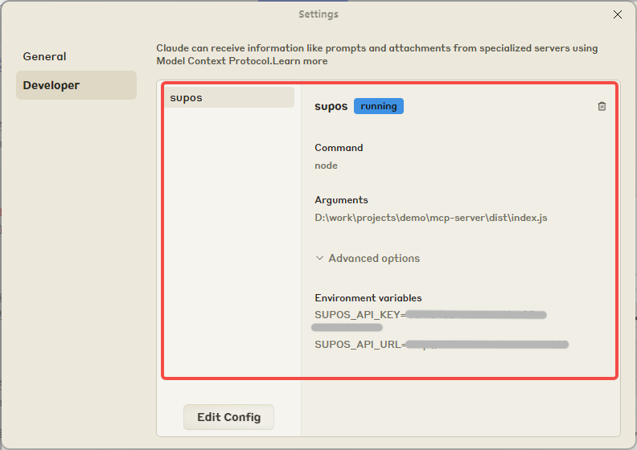
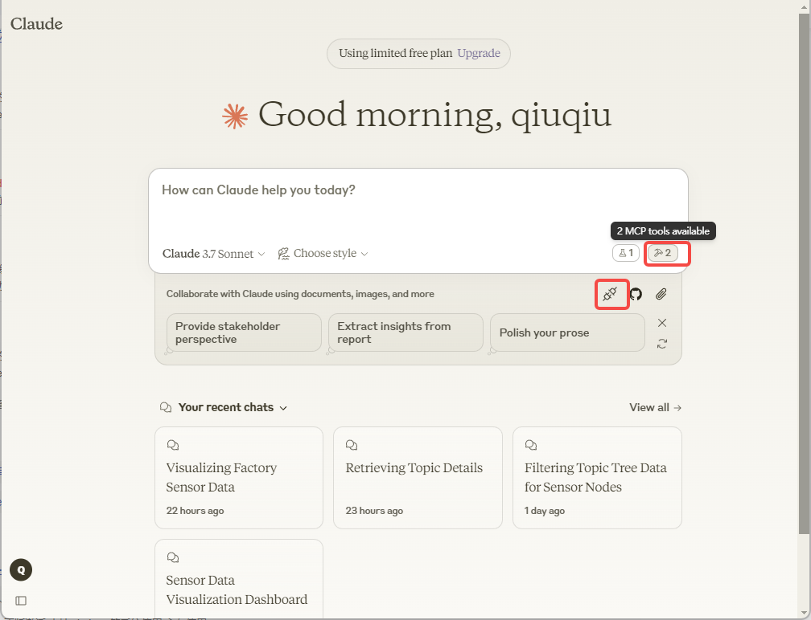
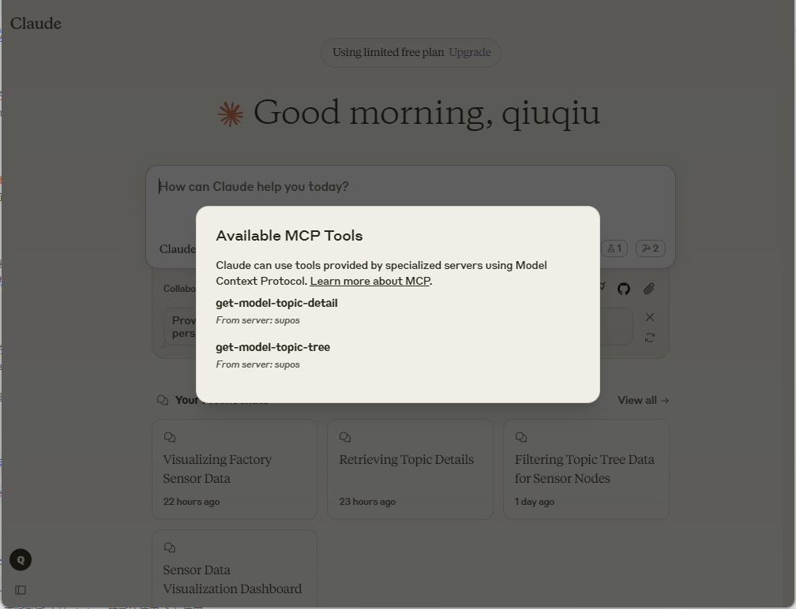

**English** | [中文][readme-zh-link]

# supOS MCP Server

This MCP server is developed based on the `typescript-sdk` provided by the [Model Context Protocol (MCP)](https://modelcontextprotocol.io/introduction) protocol, allowing any client that supports the MCP protocol to use it.

It provides a series of supOS open-apis, such as querying topic tree structure, topic details, etc.

<a href="https://glama.ai/mcp/servers/7ayh12mg77">
   
 </a>

## Supported APIs

### Tools

1. `get-model-topic-tree`

   - Query topic tree structure menu data
   - Input:
     - `key` (string): Fuzzy search keyword for child nodes
     - `showRec` (boolean): Number of records to display
     - `type` (string): Search type: 1--Text search, 2--Tag search
   - Returns: topic tree structure menu data

2. `get-model-topic-detail`

   - Get details of a specific topic
   - Input:
     - `topic` (string): The topic path corresponding to the model
   - Returns: details of a specific topic

3. `get-topic-realtime-data`

   - Get real-time data of a specific topic
   - Input:
     - `topic` (string): The topic path corresponding to the model
   - Returns: real-time data of a specific topic

4. `get-all-topic-realtime-data`

   - Get and analyze real-time data of all topics
   - Returns: real-time data of all topics

5. `get-topic-history-data-by-graphql`

   - Get history data of a specific topic from graphql
   - Input:
     - `topic` (string): The topic path corresponding to the model
     - `limit` (number): Limit number of records
     - `startTime` (string): Start time in ISO 8601 format, e.g., 2025-04-13T00:00:00Z. If not specified, defaults to one week before the current time
     - `endTime`: End time in ISO 8601 format, e.g., 2025-04-20T23:59:59Z. If not specified, defaults to the current time
   - Returns: history data of a specific topic

**_Let's follow the documentation to start using it_**

## Getting Started

### System Requirements

- Node.js

### Installing Client

Currently, there are many clients that support the MCP protocol, such as desktop applications like `Claude for Desktop`, or IDE plugins (like the `Cline` plugin for `VSCode`). To learn about supported clients, visit [Model Context Protocol Client](https://modelcontextprotocol.io/clients).

Here we'll use `Claude for Desktop` as an example.

- Download [Claude for Desktop](https://claude.ai/download).
- Configure the required MCP server for `Claude for Desktop`.

- - Open your `Claude for Desktop` configuration in a text editor: `~/Library/Application Support/Claude/claude_desktop_config.json`.
- - You can also find this configuration file location by clicking `Edit Config` in `File -> Setting -> Developer`:
    
    
    
- - After opening the configuration file, add the following content to `claude_desktop_config.json` and restart the application:  
    _Note: The application needs to be restarted after each modification of this configuration file for changes to take effect._

        ```json
        {
          "mcpServers": {
            "supos": {
              "command": "npx",
              "args": [
                "-y",
                "mcp-server-supos"
              ],
              "env": {
                "SUPOS_API_KEY": "<API_KEY>",
                "SUPOS_API_URL": "<API_URL>",
                "SUPOS_MQTT_URL": "<MQTT_URL>"
              }
            }
          }
        }
        ```

- - Where `API_URL` is the accessible address of [supOS Community Edition](https://supos-demo.supos.app/). `API_KEY` can be found by logging into the community edition, going to `DataModeling -> View specific topic details -> Data Operation -> Fetch`, and copying the corresponding ApiKey. `MQTT_URL` can be found by visiting `UNS -> MqttBroker -> Listeners` to view the subscribable address.

**Note: The above configuration of the MCP server uses `npx` to pull the `mcp-server-supos` npm package and run it locally to provide services to clients. However, `npx` may have issues reading environment variable `env` configurations on `Windows` systems, so the following solutions can be adopted:**

### Running Service Locally

Choose one of the following two methods:

- Install `mcp-server-supos` locally and run it through node

1. Install

```bash
npm install mcp-server-supos -g
```

2. Find the installed package path, for example: `"C://Users//<USER_NAME>//AppData//Roaming//npm//node_modules//mcp-server-supos//dist//index.js"`

3. Modify the configuration in `claude_desktop_config.json` and restart the application

```json
{
  "mcpServers": {
    "supos": {
      "command": "node",
      "args": [
        "C://Users//<USER_NAME>//AppData//Roaming//npm//node_modules//mcp-server-supos//dist//index.js"
      ],
      "env": {
        "SUPOS_API_KEY": "<API_KEY>",
        "SUPOS_API_URL": "<API_URL>",
        "SUPOS_MQTT_URL": "<MQTT_URL>"
      }
    }
  }
}
```

- Download and compile the repository source code locally

1. Clone the repository:

```bash
git clone https://github.com/FREEZONEX/mcp-server-supos.git
```

2. Install dependencies

```bash
npm ci
```

3. Build

```bash
npm run build
```

4. Modify the configuration in `claude_desktop_config.json` and restart the application

```json
{
  "mcpServers": {
    "supos": {
      "command": "node",
      "args": ["<local project path>//dist//index.js"],
      "env": {
        "SUPOS_API_KEY": "<API_KEY>",
        "SUPOS_API_URL": "<API_URL>",
        "SUPOS_MQTT_URL": "<MQTT_URL>"
      }
    }
  }
}
```

### Conclusion

That's the complete tutorial for using this service. After successful configuration, you can see the corresponding services and tools in the following panels:




### Final Note

[supOS Community Edition](https://supos-demo.supos.app/) has integrated the [open-mcp-client](https://github.com/CopilotKit/open-mcp-client) open-sourced by `CopilotKit` authors, and built-in the `mcp-server-supos` service, supporting ts version `agent`. The source code can be accessed at [supOS-CE-McpClient](https://github.com/FREEZONEX/supOS-CE-McpClient).

## License

This project is licensed under the Apache License 2.0 - see the [LICENSE](./LICENSE) file for details.

<!-- Links -->

[readme-zh-link]: ./README-zh.md
